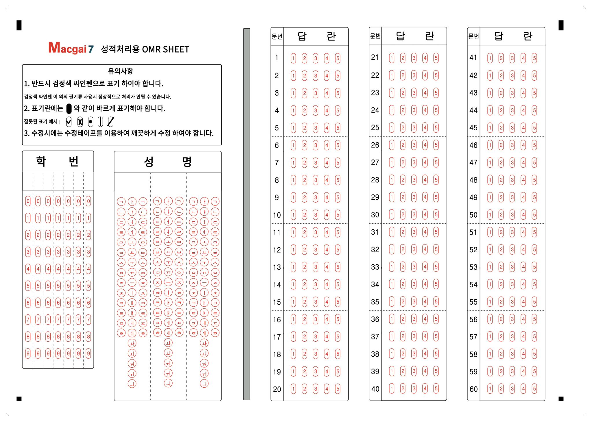
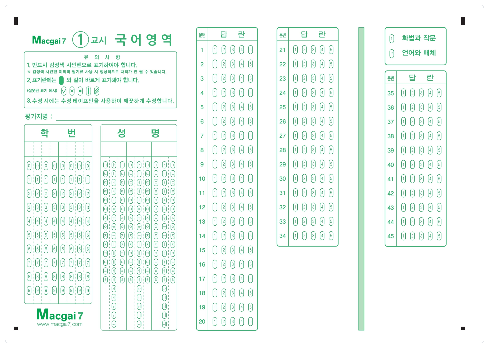
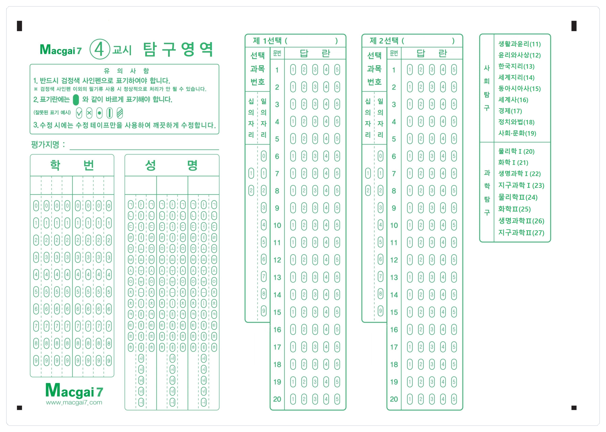

# OMRSA 소개

## <mark style="color:purple;">1.</mark> <mark style="color:purple;"></mark><mark style="color:purple;">**제품의 특장점**</mark>

### 별도 OMR 카드 제작 없이 사용

**A4 용지**를 이용해 OMR 카드를 인쇄하여 사용할 수 있어요

### 일반 복합기의 스캐너 이용

고가의 스캔 장비 구매 없이 가지고 계신 **복합기의 스캐너**를 사용하세요.

### 충전식 사용

필요한 채점 건 수 만큼 충전해서 사용하세요. 충전 포인트는 사용 전까지 사라지지 않아요.

| 충전금액  | 건당 비용 | 총 처리 건수 |
| ----- | ----- | ------- |
| 6만원   | 150원  | 400건    |
| 10만원  | 125원  | 800건    |
| 30만원  | 100원  | 3,000건  |
| 50만원  | 80원   | 6,250건  |
| 100만원 | 70원   | 14,285건 |

## <mark style="color:purple;">2. 다양한 시험 형태 지원</mark>

### 일반 시험

* 최대 125문항 까지 사용 가능(선다형만 사용할 경우)
* 주관식 문항도 지원해요 (채점 후 점수 마킹 방식)



최대 125 문항 처리 가능

<figure><figcaption></figcaption></figure>



**ABCDE**로 구성된 답안도 사용할 수 있어요

<figure><figcaption></figcaption></figure>



채점자가 점수를 마킹하여 사용하는 주관식 답안도 사용할 수 있어요

<figure><figcaption></figcaption></figure>



### 수능 모의고사

* **지원 과목**: 국어, 수학, 탐구, 한국사, 영어
* 국어, 수학, 탐구 영역의 <mark style="color:red;">**선택 과목 자동 채점**</mark> 지원




<figure><figcaption></figcaption></figure>




<figure><figcaption></figcaption></figure>



<figure><figcaption></figcaption></figure>



### 큐넷 국가자격시험

<figure><figcaption></figcaption></figure>

## <mark style="color:purple;">3. OMR 커스텀 기능</mark>

제공되는 OMR 외에 원하는 형태의 OMR을 프로그램 내에서 만들어 사용할 수 있어요.

해당 항목 외의 커스텀이 추가 필요하신 경우 [💬 맥가이 고객센터](https://macgai7.channel.io/home)로 별도 문의 주시면 상세히 답변드릴게요.


**변경 가능한 항목**

1. 타이틀 및 로고
2. 학번 타이틀 (최대 5자)
3. 학번 자릿수 (4\~8자리)
4. 객관식 문항 수 (최대 100문항, 주관식 사용 시 최대 50문항)
5. 보기 갯수 : **5지 선다** 혹은 **4지 선다**
6. 보기 타입: **12345** 또는 **ABCDE**
7. 주관식 문항 수 (최대 8개)&#x20;


### 커스텀 OMR 추가 메뉴

<figure><figcaption></figcaption></figure>

### 커스텀 적용 후

<figure><figcaption></figcaption></figure>

## <mark style="color:purple;">4. 성적 결과 활용</mark>

### 성적표 인쇄

성적 처리가 완료되면 성적표를 인쇄할 수 있어요.

* 영역 별 성취도: 표와 방사형 그래프를 제공
* 문항 채점표 (정답률: 전체 시험 기준 정답률)

<figure><figcaption></figcaption></figure>

### 성적 결과 문자 발송

문자로 시험 결과 요약과 성적표를 볼 수 있는 링크를 발송할 수 있어요. 개별 학생의 정보 및 시험 결과에 따라 내용이 채워집니다.

<figure><figcaption></figcaption></figure>


문자 발송 시 별도의 포인트 충전이 필요해요&#x20;

* 1건 당 45원 (LMS로 발송됩니다)


### 성적 처리 데이터 활용

문항 분석표 및 결과표를 이용해 성적 처리 데이터를 원하는대로 가공하여 활용하실 수 있어요

## <mark style="color:purple;">5. 성적 처리 과정 간략히 보기</mark>


**과정 요약**

시험정보입력 → OMR 인쇄 → 시험 진행 및 OMR 수거 → OMR 스캔 → 채점 및 결과 저장&#x20;

→ 성적표 인쇄 / 성적 결과 문자 발송


#### 1) 시험 정보 입력

<figure><figcaption></figcaption></figure>

#### 2) 시험에 맞는 OMR 인쇄

A4 용지 사용, 필요한 경우 인쇄 업체를 통해 별도 제작해서 사용 가능해요

<figure><figcaption></figcaption></figure>

#### 3) 시험 진행 후 OMR 수거

시험을 진행하고 마킹된 OMR을 수거합니다.

#### 4) OMR 스캔

PDF 또는 이미지 스캔 방식 모두를 지원

#### 5) 채점 및 결과 저장

저장 된 스캔 파일을 불러와 채점을 진행합니다.

<figure><figcaption></figcaption></figure>

#### 6) 성적표 인쇄 및 문자 발송



결과 처리 메뉴에서 시험을 선택하여 문항분석표 저장, 성적결과 문자 전송, 인쇄를 할 수 있어요.

<figure><figcaption></figcaption></figure>





<figure><figcaption></figcaption></figure>




## :question:자주 묻는 질문

#### Q1. 성적표 양식을 변경할 수 있나요?

현재는 단일 양식만 가능하며 항목의 변경은 지원하지 않아요.


(참고) 학원 관리 솔루션 사용 시 [**추가 성적표 양식**](https://docs.macgai7.com/macgai-manual/test/add-test/form)을 제공합니다.


#### Q2. 컴퓨터용 싸인펜으로만 마킹을 해야 하나요?

흑색 필기구도 인식이 가능합니다. 다만 인식률이 다소 떨어질 수 있으므로 컴퓨터용 싸인펜의 사용을 권장드려요.

#### Q3. 성적의 누적 관리가 가능한가요?

아쉽게도 누적 성적 관리는 학원 관리 솔루션에서만 지원합니다. OMRSA는 단독 시험 처리를 위해 만들어진 프로그램이므로 누적 성적 관리가 필요한 경우 학원 관리 솔루션을 이용해주셔야 합니다.

* [학원 관리 솔루션 맥가이 소개 보러가기 →](https://intro.macgai7.com/)

#### Q4. OMR 카드의 문항 수와 시험의 문항 수는 일치해야 하나요?

OMR 카드에 마킹 가능한 문항 수보다 시험의 문제 수가 작거나 같으면 처리 가능합니다.

#### Q5. OMR 용지에 수정테이프를 사용해도 되나요?

네. 수정테이프를 사용해도 문제 없이 인식됩니다.

## 가입 및 사용하기


**Windows 10** 이상의 환경에서만 동작합니다.


프로그램 설치 후 회원 가입을 진행하시면 채점 솔루션을 바로 이용할 수 있어요. 가입 후 시험 사용을 위해 채점 50건과 문자 10건이 충전되어 있습니다.&#x20;

### :inbox\_tray:[OMRSA 다운로드](https://www.macgai7.com/setup/OMRm7\_setup/OMRm7\_Setup.msi)

#### :closed\_book: [사용설명서](https://www.macgai7.com/setup/OMRm7\_setup/OMRm7\_%EC%82%AC%EC%9A%A9%EC%84%A4%EB%AA%85%EC%84%9C.pdf)

사용하면서 궁금한 부분이 있으시면 [💬 맥가이 고객센터](https://macgai7.channel.io/home) 를 통해 언제든 편하게 문의주세요 😁
